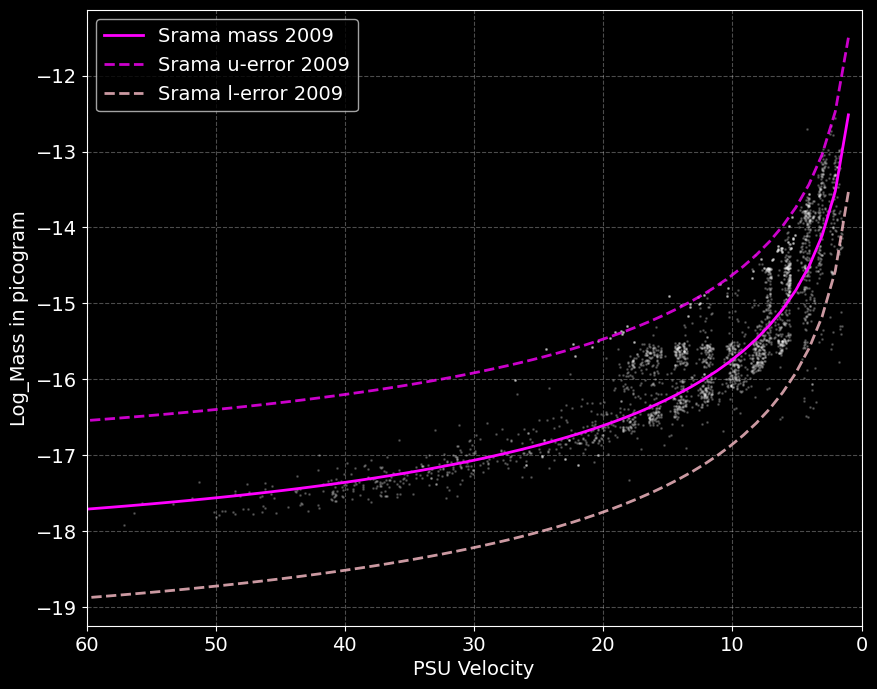
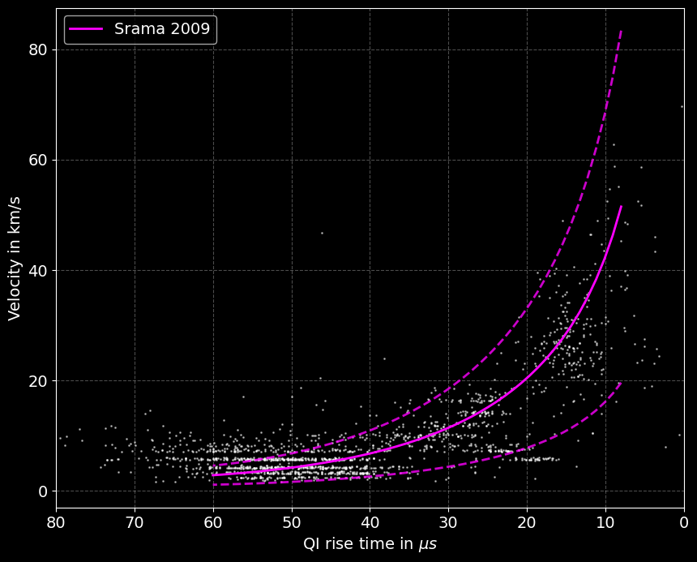

# Reproduced Cassini's Cosmic Dust Analyzer Calibration Research Paper

This project reproduces the calibration functions of Cassini's Cosmic Dust Analyzer (CDA) based on the work presented in "Cassini-Huygens and Beyond – Tools for Dust Astronomy" by Dr.-Ing. Ralf Srama. The goal is to replicate the calibration equations and visualize the results using Python.

## Project Structure

- `eda.ipynb`: Exploratory Data Analysis
- `calibration.ipynb`: Main Jupyter notebook containing the implementation of the calibration functions and visualization of the results.
- `scripts/`: Directory containing additional scripts and functions used in the project.

## Installation

1. Clone the repository:
    ```sh
    git clone https://github.com/yourusername/cassini.git
    cd cassini
    ```

2. Create a virtual environment and activate it:
    ```sh
    python -m venv venv
    source venv/bin/activate  # On Windows use `venv\Scripts\activate`
    ```

3. Install the required dependencies:
    ```sh
    pip install -r requirements.txt
    ```

## Usage

1. Open the Jupyter notebook:
    ```sh
    jupyter notebook calibration.ipynb
    ```

2. Run the cells in the notebook to reproduce the calibration functions and visualize the results.

## Calibration Functions

The main calibration functions implemented in this project are:

- `srama_mass_cat_2009(chnl, psu_vel, qi_charge)`: Calculates the mass of particles based on the provided channel, PSU velocity, and QI charge.
- `srama_velocity_2000(chnl, trise)`: Calculates the velocity of particles based on the provided channel and rise time.
- `srama_velocity_2009(chnl, trise, chk)`: Calculates the velocity of particles based on the provided channel, rise time, and a check flag.

## Visualization

The notebook includes visualizations of the calibration results using Matplotlib. The plots show the relationship between PSU velocity and mass, including error margins.

Example plot snippet from `calibration.ipynb`:




## Future work
- A potential expansion of this project involves using the benchmark set in the referenced paper as a baseline and then applying state-of-the-art machine learning models to derive improved equations that better fit the calibration curves. This approach aims to enhance the accuracy and reliability of the calibration functions by leveraging advanced data-driven techniques.

## References
- Srama, R. (2009). Cassini-Huygens and Beyond – Tools for Dust Astronomy.

## Acknowledgements
- Special thanks to Dr.-Ing. Ralf Srama for his work on the calibration equations and the Cassini-Huygens mission team for their contributions to space exploration